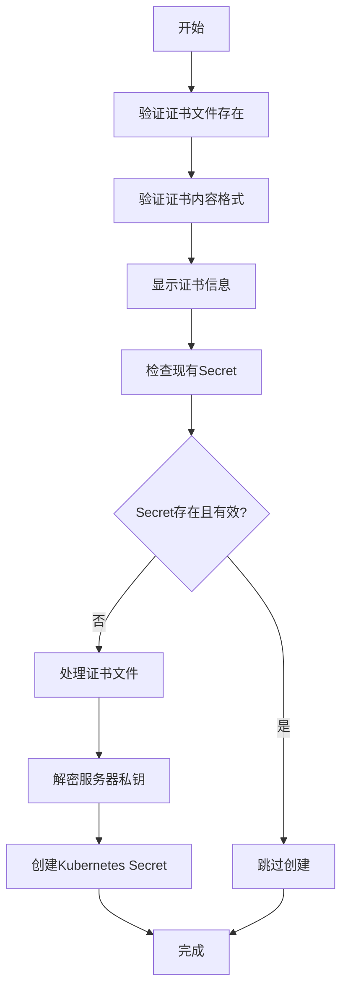

# Octavia证书自动导入工具

OpenStack Octavia负载均衡服务的证书管理工具，用于将离线生成的PKI证书安全地导入到Kubernetes Secret中。

## 概述

本工具遵循PKI最佳实践，采用离线生成证书、在线导入的安全模式：

1. **离线生成**：在安全环境中使用`create_dual_intermediate_CA.sh`生成完整的PKI证书体系
2. **安全传输**：将必要的证书文件安全传输到Kubernetes部署环境
3. **智能导入**：使用`create-dual-certs.sh`将证书导入到Kubernetes Secret
4. **自动管理**：支持证书有效期检查和智能更新

## 前置要求

### 系统要求

- OpenSSL 1.1.1+
- kubectl（已配置访问目标Kubernetes集群）
- bash 4.0+
- base64工具

### Kubernetes环境

- 已创建`openstack`命名空间
- 具有创建/更新Secret的RBAC权限

### 证书要求

- 已使用`create_dual_intermediate_CA.sh`生成的完整PKI证书体系
- 证书文件位于标准路径：`dual_ca/etc/octavia/certs/`

## 快速开始

### 1. 下载证书生成脚本（离线环境）

```bash
# 在安全的离线环境中下载所需文件
mkdir -p octavia-cert-generator
cd octavia-cert-generator

# 下载证书生成脚本
curl -O https://raw.githubusercontent.com/openstack/octavia/master/bin/create_dual_intermediate_CA.sh

# 下载OpenSSL配置文件
curl -O https://raw.githubusercontent.com/openstack/octavia/master/bin/openssl.cnf

# 添加执行权限
chmod +x create_dual_intermediate_CA.sh

# 生成证书
./create_dual_intermediate_CA.sh

# 生成的证书位于：dual_ca/etc/octavia/certs/
```

### 2. 传输证书文件

```bash
# 安全传输必要的证书文件到部署环境
# 只传输Octavia运行时需要的证书，不传输根CA私钥
scp -r dual_ca/etc/octavia/certs/ user@deploy-server:/tmp/octavia-certs/

# 或使用rsync
rsync -avz --progress dual_ca/etc/octavia/certs/ \
    user@deploy-server:/tmp/octavia-certs/

# 验证传输的文件
ssh user@deploy-server "ls -la /tmp/octavia-certs/"
# 应该包含以下5个文件：
# client.cert-and-key.pem
# client_ca.cert.pem  
# server_ca-chain.cert.pem
# server_ca.cert.pem
# server_ca.key.pem
```

### 3. 导入证书到Kubernetes

```bash
# 设置环境变量
export CA_PASSPHRASE="not-secure-passphrase"  # 默认密码，生产环境请使用强密码
export CERT_SOURCE_PATH="/tmp/octavia-certs"

# 执行导入
./create-dual-certs.sh
```

**密码说明**: `create_dual_intermediate_CA.sh`脚本默认使用密码`not-secure-passphrase`。如果您在生成证书时修改了密码，请在此处使用相应的密码。

### 4. 验证导入结果

```bash
# 检查Secret
kubectl get secret octavia-certs -n openstack
kubectl describe secret octavia-certs -n openstack

# 验证证书内容
kubectl get secret octavia-certs -n openstack -o jsonpath='{.data.ca_01\.pem}' | \
  base64 -d | openssl x509 -text -noout | head -20
```

## 证书生成详解

### create_dual_intermediate_CA.sh 脚本用法

这是Octavia官方提供的双中级CA证书生成脚本，支持自定义配置。

#### 基本用法

```bash
# 使用默认配置生成证书
./create_dual_intermediate_CA.sh

# 使用自定义OpenSSL配置文件
./create_dual_intermediate_CA.sh /path/to/custom/openssl.cnf

# 指定输出目录和配置文件
./create_dual_intermediate_CA.sh /path/to/custom/openssl.cnf /custom/output/directory
```

#### 默认配置

- **默认密码**: `not-secure-passphrase`
- **默认输出目录**: `dual_ca/`
- **默认配置文件**: 脚本同目录下的`openssl.cnf`

#### 生成的证书结构

```
dual_ca/
├── client_ca/                          # 客户端CA
│   ├── certs/
│   │   └── ca.cert.pem                 # 客户端根CA证书
│   ├── intermediate_ca/                # 客户端中级CA
│   │   ├── ca-chain.cert.pem           # 客户端CA证书链
│   │   ├── certs/
│   │   │   ├── controller.cert.pem     # 控制器证书
│   │   │   └── intermediate.cert.pem   # 中级CA证书
│   │   └── private/
│   │       ├── client.cert-and-key.pem # 客户端证书+私钥
│   │       ├── controller.key.pem      # 控制器私钥
│   │       └── intermediate.ca.key.pem # 中级CA私钥
│   └── private/
│       └── ca.key.pem                  # 根CA私钥
├── server_ca/                          # 服务器CA
│   ├── certs/
│   │   └── ca.cert.pem                 # 服务器根CA证书
│   ├── intermediate_ca/                # 服务器中级CA
│   │   ├── ca-chain.cert.pem           # 服务器CA证书链
│   │   ├── certs/
│   │   │   └── intermediate.cert.pem   # 中级CA证书
│   │   └── private/
│   │       └── intermediate.ca.key.pem # 中级CA私钥
│   └── private/
│       └── ca.key.pem                  # 根CA私钥
└── etc/
    └── octavia/
        └── certs/                      # Octavia使用的证书
            ├── client.cert-and-key.pem
            ├── client_ca.cert.pem
            ├── server_ca-chain.cert.pem
            ├── server_ca.cert.pem
            └── server_ca.key.pem
```

#### 自定义配置示例

##### 自定义密码

修改`openssl.cnf`文件或在脚本中替换默认密码：

```bash
# 在脚本中找到并修改密码
sed -i 's/not-secure-passphrase/your-strong-password/g' create_dual_intermediate_CA.sh
```

##### 自定义证书主题

修改`openssl.cnf`文件中的默认值：

```conf
# 在openssl.cnf中修改这些默认值
countryName_default             = CN
stateOrProvinceName_default     = Beijing
localityName_default            = Beijing
0.organizationName_default      = YourCompany
organizationalUnitName_default  = IT
commonName_default              = your-domain.com
```

##### 自定义证书有效期

在`openssl.cnf`中修改：

```conf
# 根CA有效期（默认20年）
default_days      = 7300

# 中级CA有效期（默认10年）
default_days      = 3650
```

#### 生产环境建议

1. **使用强密码**：

```bash
# 生成随机密码
STRONG_PASSWORD=$(openssl rand -base64 32)
echo "生成的密码: $STRONG_PASSWORD"

# 修改脚本中的密码
sed -i "s/not-secure-passphrase/$STRONG_PASSWORD/g" create_dual_intermediate_CA.sh
```

1. **自定义证书主题**：

```bash
# 复制并修改配置文件
cp openssl.cnf custom-openssl.cnf

# 编辑custom-openssl.cnf，修改默认值
# 然后使用自定义配置生成证书
./create_dual_intermediate_CA.sh custom-openssl.cnf
```

1. **安全存储**：

```bash
# 生成证书后立即备份重要文件
tar -czf octavia-ca-backup-$(date +%Y%m%d).tar.gz dual_ca/

# 安全删除临时文件
shred -vfz -n 3 dual_ca/client_ca/private/ca.key.pem
shred -vfz -n 3 dual_ca/server_ca/private/ca.key.pem
```

#### 脚本安全警告

脚本开头会显示安全警告：

```
!!!!!!!!!!!!!!!Do not use this script for deployments!!!!!!!!!!!!!
Please use the Octavia Certificate Configuration guide:
https://docs.openstack.org/octavia/latest/admin/guides/certificates.html
!!!!!!!!!!!!!!!!!!!!!!!!!!!!!!!!!!!!!!!!!!!!!!!!!!!!!!!!!!!!!!!!!
```

这是因为脚本使用了较弱的加密参数以节省测试环境资源。生产环境应该：

- 使用更强的加密算法（如aes256）
- 使用更长的密钥长度（4096位）
- 使用更复杂的密码
- 遵循组织的PKI安全政策

#### 验证生成的证书

```bash
# 验证客户端CA证书链
openssl verify -CAfile dual_ca/etc/octavia/certs/client_ca.cert.pem \
    dual_ca/etc/octavia/certs/client.cert-and-key.pem

# 验证服务器CA证书链
openssl verify -CAfile dual_ca/etc/octavia/certs/server_ca-chain.cert.pem \
    dual_ca/etc/octavia/certs/server_ca.cert.pem

# 查看证书详细信息
openssl x509 -in dual_ca/etc/octavia/certs/client_ca.cert.pem -text -noout
openssl x509 -in dual_ca/etc/octavia/certs/client.cert-and-key.pem -text -noout
```

### 环境变量配置

| 变量名             | 默认值                           | 说明           |
| ------------------ | -------------------------------- | -------------- |
| `CERT_SOURCE_PATH` | `/tmp/dual_ca/etc/octavia/certs` | 证书文件源路径 |
| `CA_PASSPHRASE`    | `not-secure-passphrase`          | CA私钥密码     |

### 证书文件映射

脚本会将以下证书文件映射到Kubernetes Secret中：

| Secret键名   | 源文件                    | 用途                              | 大小（大约） |
| ------------ | ------------------------- | --------------------------------- | ------------ |
| `ca_01.pem`  | `client_ca.cert.pem`      | 客户端CA证书链，用于验证Amphora   | ~2.7KB       |
| `cakey.pem`  | `server_ca.key.pem`       | 服务器CA私钥，用于签发Amphora证书 | ~1.7KB       |
| `client.pem` | `client.cert-and-key.pem` | 客户端证书+私钥，用于控制器认证   | ~3.2KB       |

### 脚本执行流程



## 证书管理

### 智能更新机制

脚本包含智能证书管理功能：

- **存在性检查**：验证Secret和必需的证书键是否存在
- **有效期检查**：检查证书是否在30天内过期
- **自动跳过**：如果证书有效，跳过重复创建
- **强制更新**：删除现有Secret可强制重新创建

### 证书轮换

#### 自动轮换

```bash
# 脚本会自动检测即将过期的证书（30天内）
./create-dual-certs.sh  # 如果证书即将过期，会自动更新
```

#### 手动轮换

```bash
# 强制更新证书
kubectl delete secret octavia-certs -n openstack
./create-dual-certs.sh
```

### 证书验证

#### 验证证书有效期

```bash
# 检查客户端CA证书
kubectl get secret octavia-certs -n openstack -o jsonpath='{.data.ca_01\.pem}' | \
  base64 -d | openssl x509 -dates -noout

# 检查客户端证书
kubectl get secret octavia-certs -n openstack -o jsonpath='{.data.client\.pem}' | \
  base64 -d | openssl x509 -dates -noout
```

#### 验证证书链

```bash
# 验证客户端CA证书链
kubectl get secret octavia-certs -n openstack -o jsonpath='{.data.ca_01\.pem}' | \
  base64 -d | openssl crl2pkcs7 -nocrl -certfile /dev/stdin | \
  openssl pkcs7 -print_certs -noout
```

## 安全考虑

### PKI最佳实践

1. **根CA离线保存**：根CA私钥应保存在离线、安全的环境中
2. **密码保护**：所有CA私钥都应使用强密码保护
3. **最小权限**：Octavia仅获得运行时必需的证书
4. **定期轮换**：建议每年更新证书

### 生产环境配置

#### 强密码设置

```bash
# 使用强随机密码
export CA_PASSPHRASE="$(openssl rand -base64 32)"
echo "请保存此密码: $CA_PASSPHRASE"
```

#### RBAC权限控制

```yaml
apiVersion: rbac.authorization.k8s.io/v1
kind: Role
metadata:
  namespace: openstack
  name: octavia-cert-manager
rules:
- apiGroups: [""]
  resources: ["secrets"]
  resourceNames: ["octavia-certs"]
  verbs: ["get", "list", "create", "update", "patch", "delete"]
```

### 安全传输

```bash
# 使用SCP安全传输
scp -i ~/.ssh/deploy_key -r dual_ca/etc/octavia/certs/ \
  deploy@target-server:/secure/path/

# 或使用rsync加密传输
rsync -avz -e "ssh -i ~/.ssh/deploy_key" \
  dual_ca/etc/octavia/certs/ \
  deploy@target-server:/secure/path/
```

## 故障排除

### 常见问题

#### 1. 密码错误

```
错误：server_ca.key.pem 不是有效的私钥文件，或密码错误
```

**解决方案**：

```bash
# 确认密码正确
export CA_PASSPHRASE="correct-password"
# 手动验证密码
openssl rsa -in server_ca.key.pem -check -noout -passin pass:$CA_PASSPHRASE
```

#### 2. 证书文件缺失

```
错误：以下证书文件缺失：
/path/to/client_ca.cert.pem
```

**解决方案**：

```bash
# 检查文件路径
ls -la $CERT_SOURCE_PATH/
# 确认create_dual_intermediate_CA.sh已成功执行
```

#### 3. kubectl权限不足

```
Error from server (Forbidden): secrets is forbidden
```

**解决方案**：

```bash
# 检查RBAC权限
kubectl auth can-i create secrets -n openstack
kubectl auth can-i update secrets -n openstack
```

#### 4. 证书格式错误

```
错误：client_ca.cert.pem 不是有效的证书文件
```

**解决方案**：

```bash
# 验证证书格式
openssl x509 -in client_ca.cert.pem -text -noout
# 检查文件是否损坏
file client_ca.cert.pem
```

### 调试模式

```bash
# 启用详细日志
set -x
./create-dual-certs.sh

# 逐步验证
export CA_PASSPHRASE="your-password"
export CERT_SOURCE_PATH="/path/to/certs"

# 1. 验证文件存在
ls -la $CERT_SOURCE_PATH/

# 2. 验证证书格式
for cert in client_ca.cert.pem client.cert-and-key.pem; do
  echo "检查 $cert:"
  openssl x509 -in "$CERT_SOURCE_PATH/$cert" -text -noout | head -10
done

# 3. 验证私钥
openssl rsa -in "$CERT_SOURCE_PATH/server_ca.key.pem" -check -noout \
  -passin pass:$CA_PASSPHRASE
```

### 日志分析

脚本输出包含详细的执行信息：

```bash
# 成功的输出示例
开始导入Octavia证书到Kubernetes Secret...
证书源路径: /path/to/certs
所有证书文件验证通过
证书内容验证通过
=== 证书信息汇总 ===
客户端CA证书信息：
  Serial Number: 4096 (0x1000)
  Subject: CN=ClientIntermediateCA
处理加密私钥: server_ca.key.pem -> cakey.pem
writing RSA key
secret/octavia-certs created
证书导入完成！
```

## 与OpenStack-Helm集成

### 标准部署流程

```bash
# 1. 生成证书（离线）
./create_dual_intermediate_CA.sh

# 2. 导入证书
./create-dual-certs.sh

# 3. 部署Octavia
helm upgrade --install octavia ./octavia \
  --namespace=openstack \
  --values=./octavia/values.yaml

# 4. 验证部署
kubectl get pods -n openstack | grep octavia
```

### 证书挂载验证

```bash
# 检查证书是否正确挂载到Pod
kubectl exec -n openstack deployment/octavia-api -c octavia-api -- \
  ls -la /etc/octavia/certs/

# 验证证书内容
kubectl exec -n openstack deployment/octavia-api -c octavia-api -- \
  openssl x509 -in /etc/octavia/certs/ca_01.pem -text -noout | head -10
```

## 监控和维护

### 证书有效期监控

```bash
#!/bin/bash
# cert-monitor.sh - 证书有效期监控脚本

NAMESPACE="openstack"
SECRET_NAME="octavia-certs"
ALERT_DAYS=30

# 检查证书有效期
check_cert_expiry() {
    local cert_key=$1
    local cert_name=$2
    
    expiry_date=$(kubectl get secret $SECRET_NAME -n $NAMESPACE \
        -o jsonpath="{.data.$cert_key}" | base64 -d | \
        openssl x509 -enddate -noout | cut -d= -f2)
    
    expiry_epoch=$(date -d "$expiry_date" +%s)
    current_epoch=$(date +%s)
    days_until_expiry=$(( (expiry_epoch - current_epoch) / 86400 ))
    
    echo "$cert_name 将在 $days_until_expiry 天后过期"
    
    if [ $days_until_expiry -lt $ALERT_DAYS ]; then
        echo "警告: $cert_name 即将过期！"
        return 1
    fi
    return 0
}

# 检查所有证书
check_cert_expiry "ca_01.pem" "客户端CA证书"
check_cert_expiry "client.pem" "客户端证书"
```

### 自动化更新

```bash
#!/bin/bash
# auto-update-certs.sh - 自动证书更新脚本

CERT_SOURCE_PATH="/secure/octavia/certs"
CA_PASSPHRASE_FILE="/secure/ca.password"

# 读取密码
if [ -f "$CA_PASSPHRASE_FILE" ]; then
    export CA_PASSPHRASE=$(cat "$CA_PASSPHRASE_FILE")
else
    echo "错误：找不到密码文件"
    exit 1
fi

# 设置证书路径
export CERT_SOURCE_PATH

# 执行更新
./create-dual-certs.sh

# 如果证书更新了，重启相关服务
if [ $? -eq 0 ]; then
    echo "证书更新成功，重启Octavia服务..."
    kubectl rollout restart deployment/octavia-api -n openstack
    kubectl rollout restart deployment/octavia-worker -n openstack
    kubectl rollout restart deployment/octavia-housekeeping -n openstack
    kubectl rollout restart deployment/octavia-health-manager -n openstack
fi
```

## 贡献指南

### 提交Bug报告

在提交Bug报告时，请包含：

1. **系统信息**：操作系统、OpenSSL版本、kubectl版本
2. **错误日志**：完整的脚本执行日志
3. **环境配置**：相关的环境变量设置
4. **重现步骤**：详细的操作步骤

### 功能请求

欢迎提交功能请求和改进建议：

1. 描述期望的功能
2. 说明使用场景
3. 提供实现思路（如果有）

### 代码贡献

1. Fork项目仓库
2. 创建功能分支
3. 提交代码更改
4. 添加测试用例
5. 更新文档
6. 提交Pull Request

## 许可证

本项目采用Apache License 2.0许可证。详情请参见LICENSE文件。

## 联系方式

- 项目主页：[GitHub仓库链接]
- 问题反馈：[Issues页面链接]
- 邮件联系：[维护者邮箱]

------

**注意**: 本工具涉及PKI证书管理，请在生产环境中谨慎使用，并遵循您组织的安全政策。